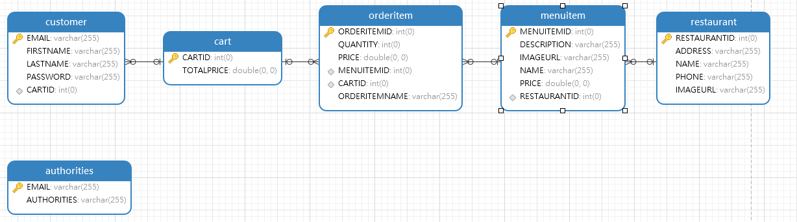

# OnlineFoodOrder

## **Project Description**
A doordash like online food order web application that allows users order food online (_This repository only includes the backend portion of the project_).

## **Frameworks**
This project backend utilized Spring Boot and MyBatis framework. 

## **Table of Contents**

### **Configurations**

**_`application.yml`_** Includes configurations for the project.

### **Database Schema**
**_`Entity classes`_** Entity classes are defined under entity package. 
Database schema is shown in the image below. 

### **3 Layers**
**_`Controller Layer`_** 
<https://github.com/nanjiamoomoo/onlineFoodOrder/tree/zackary/src/main/java/com/project/controller>
Defines all the REST APIs to handle HTTP requests and Responses. DispatcherServlet will dispatch the request based on url to the corresponding controller.

**_`Service Layer`_** 
<https://github.com/nanjiamoomoo/onlineFoodOrder/tree/zackary/src/main/java/com/project/service>
Contains all the service logic and mediates communications between controller layer and repository layer. 

**_`DAO (Mapper) Layer`_** 
<https://github.com/nanjiamoomoo/onlineFoodOrder/tree/zackary/src/main/java/com/project/mapper>
Communicates with database and do all the database CRUD(Create, Read, Update, Delete) operations. Under mapper package, defined all the interfaces and methods and these methods are mapped to the SQL statements under the corresponding xml file which are located under src/main/resources/mybatis package.
In this project, all the database operations are implemented by using MyBatis interface proxy mode which means all the methods are self-defined and there are no need to instantiate SqlSession object to call its methods to achieve database operations and nor the need to define the implementation class of each interface, MyBatis framework does 
these all.

## **How to Test**

### **Set up database**
This project used MyBatis framework which is a simpler and lighter-weight framework compared to Hibernate. Hibernate is an ORM that can convert Java entity classes into database automatically, but MyBatis is a persistence framework which emphasizes on the use of SQL and maps SQL statements to Java methods. MyBatis requires us to prepare database separately.
* Create database and tables based on the schema shown above. 
* Insert data into the restaurant table and menuitem table.
* Modify the application.yml configuration file to change the database url jdbc:mysql://{databaseurl}:3306/...

### **Use Postman to test APIs**
Postman comes with a very convenient way to test backend services.

**_`/signup`_** Create signup request by using Http POST Method. Send POST request with JSON format data in the request body to (http://Server_IP_ADDRESS:8080/signup).
{
"email": "admin@gmail.com",
"firstName": "admin",
"lastName": "admin,
"password": "111"
}

**_`/login`_** Create login request by using Http POST Method. Send POST request to (http://Server_IP_ADDRESS:8080/login). 
{
"username":"admin",
"password":"admin"
}

**_`/restaurants`_** Get restaurants info by using HTTP GET method and put http://Server_IP_ADDRESS:8080/restaurants in the address bar. 

**_`/restaurant/{id}/menu`_**  Get menu for a specific restaurant by using HTTP GET method, and put http://Server_IP_ADDRESS:8080/restaurant/1/menu in the address bar to get menu for restaurant 1. 

The following APIs can only be tested after successfully login.

**_`/order/{id}`_** Add item to the shopping cart by using HTTP POST method, and put http://Server_IP_ADDRESS:8080/order/25 in the address bar to add item 25 in the shopping cat. 

**_`/cart`_** Get shopping cart by using HTTP GET method, and put http://Server_IP_ADDRESS:8080/cart in the address bar. All the items in the shopping cart will be returned. 

**_`/checkout`_** Test checkout by using HTTP GET method, and put http://Server_IP_ADDRESS:8080/checkout in the address bar. An empty shopping cart will be returned after checkout. 